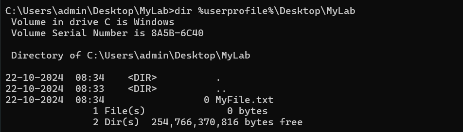
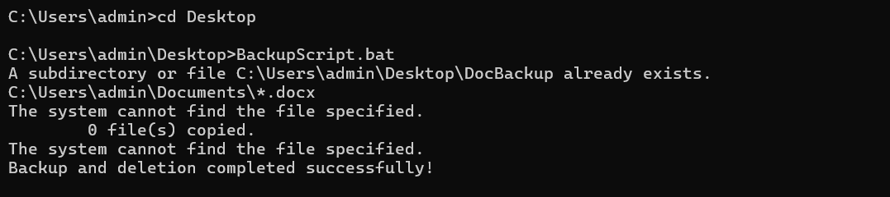

# Windows-basic-commands-batchscript

Ex08-Windows-basic-commands-batchscript

## AIM:

To execute Windows basic commands and batch scripting

## DESIGN STEPS:

### Step 1:

Navigate to any Windows environment installed on the system or installed inside a virtual environment like virtual box/vmware 

### Step 2:

Write the Windows commands / batch file.
Save each script in a file with a .bat extension.
Ensure you have the necessary permissions to perform the operations.
Adapt paths as needed based on your system configuration.

### Step 3:

Execute the necessary commands/batch file for the desired output. 

## WINDOWS COMMANDS:
## Exercise 1: Basic Directory and File Operations

## COMMAND AND OUTPUT
Create a directory named "MyLab" on the desktop.
```
mkdir %userprofile%\Desktop\MyLab
```


## COMMAND AND OUTPUT

Change to the "MyLab" directory and create an empty text file named "MyFile.txt" inside it.
```
cd %userprofile%\Desktop\MyLab
type nul > MyFile.txt
```


## COMMAND AND OUTPUT

List the contents of the "MyLab" directory.
```
dir %userprofile%\Desktop\MyLab
```


## COMMAND AND OUTPUT

Copy "MyFile.txt" to a new folder named "Backup" on the desktop.
```
mkdir %userprofile%\Desktop\Backup
copy MyFile.txt %userprofile%\Desktop\Backup
```

## COMMAND AND OUTPUT

Move the "MyLab" directory to the "Documents" folder.
```
move MyLab Documents
```


## Exercise 2: Advanced Batch Scripting

Create a batch script named "BackupScript.bat" that creates a backup of files with the ".docx" extension from the "Documents" folder to a new folder named "DocBackup" on the desktop.Modify the script to delete files with the ".docx" extension from the "Documents" folder after creating the backup. If *.docx file are not available in the Documents folder you can use “.pdf” files to copy. 

Open a notepad file named BackupScript.bat and enter the following:

```
@echo off
mkdir %userprofile%\Desktop\DocBackup
copy %userprofile%\Documents\*.docx %userprofile%\Desktop\DocBackup
del %userprofile%\Documents\DocBackup\*.docx
echo Backup and deletion completed successfully!
```
Save the file and come back to command prompt.
Now execute as
BackupScript.bat

## OUTPUT:



## RESULT:

The commands/batch files are executed successfully.

